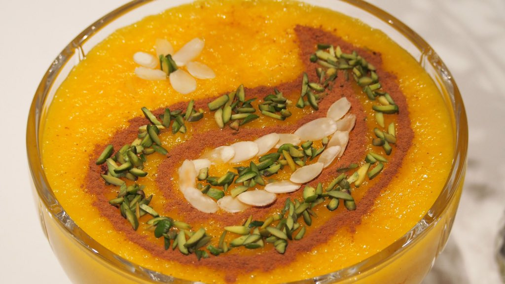

# Shole zard

Sholeh Zard hat in der iranischen Kultur einen guten Ruf. Touristen und Einheimische schätzen die Aromen dieses berühmten Rezepts und zögern nicht, es zu missbrauchen. Lassen Sie uns in diesem Artikel etwas mehr über dieses berühmte Dessert erfahren.

Ein elegantes Dessert von eindeutig orientalischer Herkunft, Rosenwasser, Safran und Pistazien sei Dank. Meine Freundin Nina, Halbperserin, hat mir das seit über 40 Jahren bewährte Rezept ihrer Tante Shore mit deren Erlaubnis für dieses Buch überlassen. Danke! Meine Variante ist nur ein klein wenig süßer, über Nacht im Kühlschrank fest werden lasse ich den Pudding genau wie im Originalrezept.

 

# Zutaten für 10:

 1.120 g Basmatireis

 2.180 g Zucker

 3.Prise Salz

 4.3 Briefchen (à 0,1 g) Safranfäden

 5.2 EL Mandelblättchen
 6.3–4 EL Rosenwasser

# Zum Bestreuen :

Mandelstifte

Pistazienstifte

wenn verfügbar kandierte

Zitrusschalen

Zimt (Ceylon)

+ 1 Reis kurz waschen und gemeinsam mit Zucker, 1,2 l Wasser und 1 guten Prise Salz in einem dickwandigen Topf langsam (!) zum Kochen bringen. Dabei immer wieder umrühren. Auf kleiner Flamme ca. 45 Minuten kochen, bis die Masse dickflüssig wird und »wie ein Vulkan zu spucken beginnt«. Währenddessen häufig umrühren, damit der Reis nicht anbrennt. Nach dieser Zeit zerfallen die Reiskörner und der Pudding dickt an. Tante Shore würde die Masse jetzt ganz kurz mit dem Mixstab etwas feiner zerkleinern, ich habe das nicht gemacht, weil der Reis auch so bereits stark zerkocht war.

+ 2 Safran nach Möglichkeit in einem kleinen Mörser zu Pulver vermahlen.

+ 3 Mandelblättchen in die Masse rühren, kurz ziehen lassen. Safran und Rosenwasser nach Geschmack dazugeben und rühren. Der Pudding färbt sich intensiv gelb.

+ 4 Masse in kleine, eher flache Schalen oder Gläser oder in eine große Schüssel füllen. Abkühlen lassen, bis eine leichte Haut entsteht. Mit Mandel- und Pistazienstiften sowie klein geschnittenen kandierten Zitrusschalen bestreuen. Komplett auskühlen lassen und dann über Nacht in den Kühlschrank stellen.

+ 5 Unbedingt eiskalt und mit Zimt bestreut servieren.

TIPPS:  
Eine kleinere Menge ist schwierig zu kochen. Der Reispudding hält aber problemlos einige Tage im Kühlschrank.

Im Original würde die doppelte Menge Safran verwendet werden. Ich mag das, aber vielen Menschen ist es zu intensiv.

Ich habe zum Bestreuen außer Mandeln und Pistazien auch selbst kandierte Meyer-Zitronenschalen verwendet und war hingerissen von der Kombination. Das Rezept findet sich auf esskultur.at

